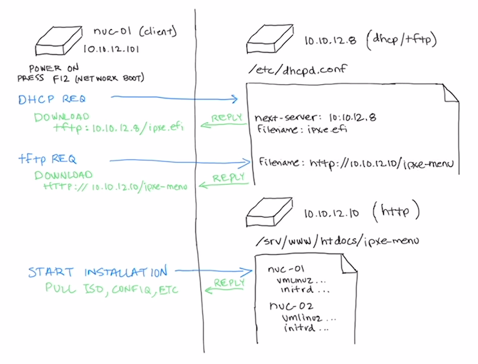

# PXE Overview

> **Status:** Work in progress.

This is not a PXE how-to guide — there are plenty of those available already. Instead, this documents how PXE is configured in this specific enclave environment to support network-based installation of the Harvester nodes.

### Nodes involved in the PXE boot flow:

* **Client** — the target node where Harvester will be installed (there are 3 in this environment)
* **HTTP Server** (`10.10.12.10`) — serves content (ISO, config files) over HTTP
* **DHCP/TFTP Server** (`10.10.12.8`) — provides PXE boot services (DHCP for IP assignment, then TFTP for boot files)

> **Note:** The paths shown in the diagram above are simplified for readability. The actual file locations differ slightly, as shown in the table below.

| Image Reference | Actual Path/Location |
|:----------------|:---------------------|
| /srv/www/htdocs/ipxe.efi | /srv/www/htdocs/harvester/harvester-edge/ipxe.efi |
| http://10.10.12.10/ipxe.efi | http://10.10.12.10/harvester/harvester-edge/ipxe.efi | 
